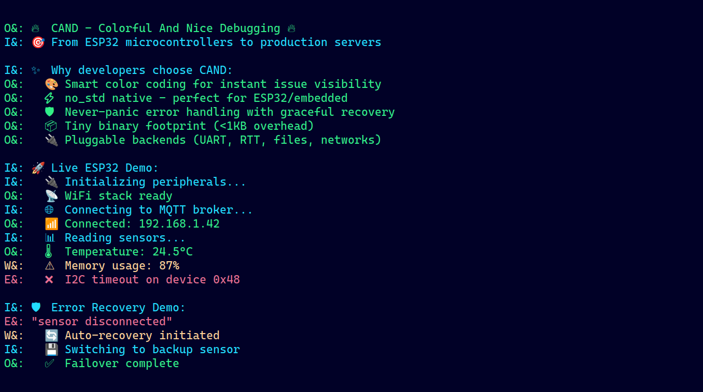

# 🎯 CAND - Colorful And Nice Debugging

> **Beautiful embedded-first Rust logging library for ESP32 to servers with colorful output and zero-panic design.**


## ✨ **Why Choose CAND?**

| **Feature** | **Benefit** | **Use Case** |
| :-- | :-- | :-- |
| 🎨 **Smart Colors** | Spot issues instantly | `logger.log_err("❌ Clear visibility")` |
| ⚡ **no_std Ready** | Runs everywhere | ESP32, STM32, WASM, bare metal |
| 🛡️ **Never Panic** | Production safe | `try_run()` and `try_get()` handles all errors gracefully |
| 🔌 **Pluggable** | Your infrastructure | Files, UART, RTT, databases, networks |
| 📦 **Tiny Binary** | <1KB overhead | Perfect for memory-constrained devices |
| 🎯 **2-Line Setup** | Start in seconds | Works out of the box |

## 🚀 **Quick Start**

### **Desktop/Server**

```toml
[dependencies]
cand = "0.2.3"
```

```rust
use cand::Logger;
use std::time::Instant;

fn main() {
  let mut logger = Logger(Instant::now(), ());
    
  logger.log_ok("🚀 Server started successfully!");
  logger.log_info("📡 Listening on port 8080");
  logger.log_warn("⚠️ High memory usage: 87%");
  logger.log_err("❌ Database connection failed");
}
```


### **Embedded/ESP32 with no_std**

```toml
[dependencies]
cand = { version = "0.2.3", default-feature=false, features=["colors"] }
```

### **Embedded/ESP32 with alloc but no_std**

```toml
[dependencies]
cand = { version = "0.2.3", default-feature=false, features=["colors", "alloc"] }
```

```rust
use cand::{ULogger, UStorageProvider};

struct UartStorage {
  // Serial can be from any MCU serial
  serial: Serial 
};

impl UStorageProvider for UartStorage {
  fn write_data(&mut self, d: impl ufmt::uDebug) {
    // Write to UART, RTT, or any embedded output
    ufmt::uwrite!(&mut self.serial, "{:?}", d).ok();
  }
}

fn main() {
  let mut logger = ULogger((), UartStorage { serial: ... });
    
  logger.log_ok("🚀 Device initialized!");
  logger.log_info("📡 Connected to network");
}
```

## 🎨 **Beautiful Output**

CAND automatically color-codes your logs for instant visual feedback:

- **🟢 `log_ok()`** - Success operations (green)
- **🔵 `log_info()`** - Informational messages (blue)
- **🟡 `log_warn()`** - Warnings that need attention (yellow)
- **🔴 `log_err()`** - Critical errors (red)



## 🛡️ **Error Handling That Never Panics**

```rust
use cand::Logger;

fn risky_operation() -> Result<String, &'static str> {
  Err("network timeout")
}

fn fallback_handler(mut logger: Logger<std::time::Instant, ()>) {
  logger.log_warn("🔄 Entering fallback mode");
  logger.log_info("💾 Switching to cached data");
}

fn main() {
  let logger = Logger(std::time::Instant::now(), ());
    
  // Automatic error logging and graceful recovery
  let (data, recovered_logger) = logger.try_get(
    risky_operation(),
    fallback_handler
  );
}


```

## 🛡️ **Panic Handling with black_box_cand**

CAND provides a macro to set up a panic handler that logs panics using the logger, ensuring even panics are captured gracefully.

```rust
use cand::{black_box_cand, Logger};

fn main() {
  black_box_cand!(); // Uses default logger for std environments

  let custom_tp = TimeProvider1::new();
  let custom_sp = StorageProvider1::new();
  // Or with custom logger
  let logger = Logger(custom_tp, custom_sp);
  black_box_cand!(logger);

  panic!("This will be logged at critical level");
}
```

For no_std environments, the macro sets a panic_handler that logs to the provided logger.

## 🔌 **Custom Storage Providers**

### **Embedded UART with ufmt**

```toml
[dependencies]
cand = { version = "0.2.3", default-feature=false, features=["colors", "ufmt"] }
```

```rust
struct UartStorage{
  // Serial can be from any mcu serial
  serial: Serial 
};

impl UStorageProvider for UartStorage {
  fn write_data(&mut self, d: impl ufmt::uDebug) {
    // Write to UART, RTT, or any embedded output
    ufmt::uwrite!(self.serial,"{:?}", d);
  }
}
```

### **Standard Output with fmt**

```rust
impl StorageProvider for () {
  fn write_data(&mut self, args: Arguments<'_>, _debuglevel: &StatusLevel) {
    print!("{args}")
  }
}
```

## 🎛️ **Feature Flags**

| **Feature** | **Description** | **Default** |
| :-- | :-- | :-- |
| `std` | Standard library support, enables `Instant` time provider | ✅ |
| `colors` | ANSI color output for beautiful terminal logs | ✅ |
| `ufmt` | Embedded-friendly formatting with zero allocations, supports both no_std and std | No |
| `alloc` | Enables Box<dyn Error> for dynamic error handling | ✅ |

## 📊 **Performance**

- **⚡ Zero allocations** with `ufmt` feature
- **🚀 1_000_000 logs in 4.2s (for alloc takes 5.1s)** on example benchmark with decent release

## 🏗️ **API Reference**

### **Core Types**

```rust
// Standard fmt-based logger
pub struct Logger<T: TimeProvider, S: StorageProvider>(pub T, pub S);

// Clonable version for multi-threaded use
pub struct MultiLogger<T: TimeProvider + Clone, S: StorageProvider + Clone>(pub T, pub S);

// ufmt-based logger (requires "ufmt" feature)
pub struct ULogger<T: TimeProvider, S: UStorageProvider>(pub T, pub S);

// Clonable ufmt-based logger
pub struct MultiULogger<T: TimeProvider + Clone, S: UStorageProvider + Clone>(pub T, pub S);
```

### **Traits**

- `TimeProvider`: For timestamping logs (e.g., `Instant` or custom)
- `StorageProvider`: For fmt-based output destinations
- `UStorageProvider`: For ufmt-based output destinations

## 🧪 **Examples**

Check out the [examples](examples/) directory:

- **[`basic_error_handling`](examples/basic_error_handling.rs)** - Error recovery patterns
- **[`sample`](examples/sample.rs)** - Feature showcase and demo
- **[`benchmark`](examples/benchmark.rs)** - Benchmark of 1_000_000 logs print
- **[`errorcand`](examples/errorcand.rs)** - Advanced error handling with try_get and try_run
- **[`paniccand`](examples/paniccand.rs)** - Panic handling demonstration with black_box_cand
- **[`custom_panic`](examples/custom_panic.rs)** - Same Panic handling but custom
- **[`custom_panic_global`](examples/custom_panic_global.rs)** - And this one is globally share

Run examples:

```bash
cargo run --example sample
```

## 📄 **License**

This project is licensed under the **MIT License** - see the [LICENSE](LICENSE) file for details.
